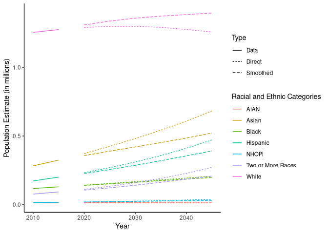
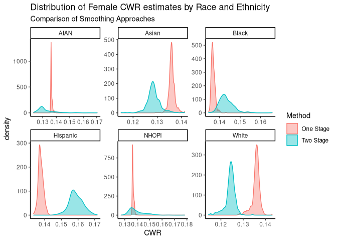

# smoothHP

`smoothHP` is an R package with a set of conveince functions and data
for making population projections using a modified version of the
Hamilton-Perry (HP) method outlined by [Takashi
Inoue 2016](https://link.springer.com/chapter/10.1007/978-3-319-43329-5_22).
Unlike the more prevalent cohort component method, the HP method allows
for population projections to be made in the absence of fertility,
mortality, and migration data, only relying on changes in population.
The version utilized in this R package allows for hierarchical smoothing
comparable to an empirical Bayes approach such that sub-population
projections may more closely resemble their group average.

## Installation

``` r
# Install directly from GitHub 
remotes::install_github("nmmarquez/smoothHP")
```

## Examples

`smoothHP` is designed to allow you to make projections testing multiple
hierarchical smoothing strategies. To demonstrate this we use data from
the [Washington State Office of Fincance and Management official
population
estimates](https://www.ofm.wa.gov/washington-data-research/population-demographics/population-estimates/april-1-official-population-estimates)
to make small area population projections for king county.

### A quick note on data structure

Currently `smoothHP` requires strict input data requirements which are
as follows

1.  A column named `Sex` indicating either “Female” or “Male”
2.  A column named `Year` which is numeric, and contains at least two
    years that are five years apart
3.  A column names `Age5` which is a factor with 18 levels or integers 1
    through 18 representing 5 year age groups from 0 to 85+
4.  A column named `value` representing a population estimates of the
    corresponding demographic group.
5.  **At least** one more column indicating the level to make
    projections at

To help with this process the package provides a utility function to
assess compatibility with the package functions.

``` r
library(smoothHP)
check_smooth_input(kc_pop_data)
```

## County Demographic Projections

The `smoothHP` package is capable of making projections at multiple
levels with various smoothing strategies using the main function
`multi_stage_group_HP_project`. Using the provided data lets say we were
interested in making projections for all provided racial and ethnic
groups without smoothing. The code would be the following

``` r
raceth_DF <- kc_pop_data[
    ,.(value = sum(value)), by = list(Year, Sex, Race, Age5, County)]

unsmooth_DF <- multi_stage_group_HP_project(
    raceth_DF, stages = list(c("County", "Race")))
```

Here we provided the `multi_stage_group_HP_project` a stages parameter
which is a list of length 1 which the function interprets to only do
only one layer of HP projections with no smoothing. If we instead we
wanted to smooth race specific estimates to the county average we would
provide a list of length 2 as seen below.

``` r
smooth_DF <- multi_stage_group_HP_project(
    raceth_DF, stages = list("County", "Race"))
```

We can compare the smooth to the non-smoothed estimates visually to see
the effects that the smoothing process had on the projections.

``` r
library(ggplot2)

raceth_DF[,Type:="Data"]
smooth_DF[,Type:="Smoothed"]
unsmooth_DF[,Type:="Direct"]

bind_rows(raceth_DF, smooth_DF, unsmooth_DF) %>%
    group_by(Year, Race, Type) %>%
    summarize(Population = sum(value) / 1000000) %>%
    ggplot(aes(x = Year, y = Population, color = Race, linetype = Type)) +
    geom_line() +
    theme_classic() +
    labs(
        y = "Population Estimate (in millions)",
        color = "Racial and Ethnic Categories")
```

<!-- -->

Direct estimates using the HP method seem to provide implausible results
in this case while using a smoothing approach gives us more reasonable
growth projections for each group.

## Race and Ethnicity Specific Small Area Projections

We may also want to do additional layers of smoothing to make race and
ethnicity specific estimates at smaller areas (and subsequently smaller
population estimates) which may be more unstable with direct estimates.
Here again we demonstrate two approaches, one where we look at each
small area estimate racial and ethic group and smooth them to the county
population totals and another which introduces a two tiered smoothing
approach. In this case rather than looking directly at the projections
we instead examine the components of the projections, specifically the
CWR estimate of the HP method.

``` r
bind_rows(
    multi_stage_CWR_estimates(
        kc_pop_data, stages = list("County", c("Race", "GEOID"))) %>%
        mutate(Method = "One Stage"),
    multi_stage_CWR_estimates(
        kc_pop_data, stages = list("County", "Race", "GEOID")) %>%
        mutate(Method = "Two Stage")) %>%
    filter(Sex == "Female" & Race != "Two or More Races") %>%
    ggplot(aes(x = CWR, fill = Method, color = Method)) +
    geom_density(alpha = .4) +
    facet_wrap(~Race, scales = "free") +
    theme_classic() +
    ggtitle(
        "Distribution of Female CWR estimates by Race and Ethnicity",
        "Comparison of Smoothing Approaches")
```

<!-- --> In this
example by using a one stage smoothing approach, we may over-smooth
estimates of CWR to the county average while a two stage approach allows
more variation between racial and ethnic groups.

All of the functions provided by the `smoothHP` package allow you to do
any number of layers of smoothing for Projections or CWR and CCR
estimates directly.

## Support

The development of this `R` package and the forthcoming research
articles associated with it were made possible by financial support from
the following organizations.


